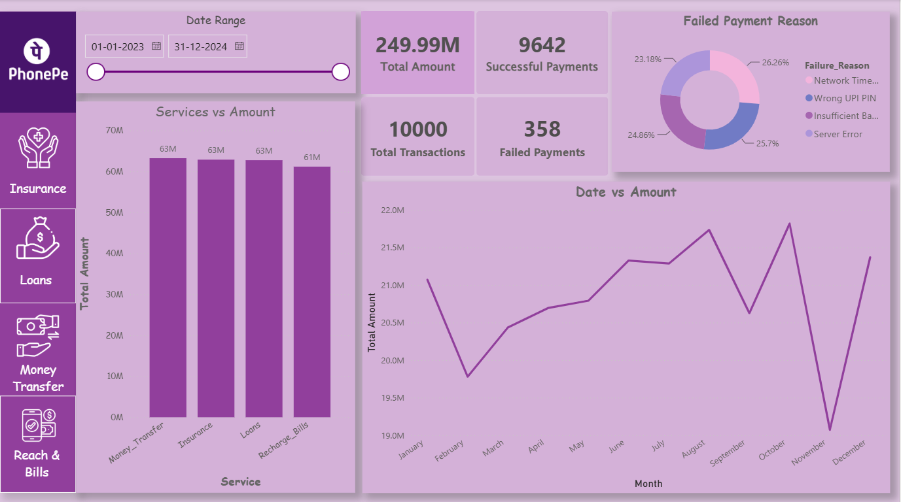
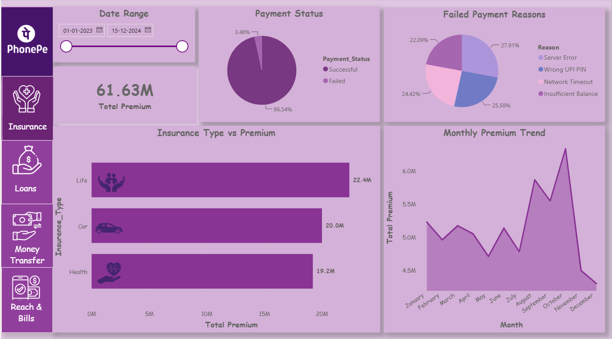
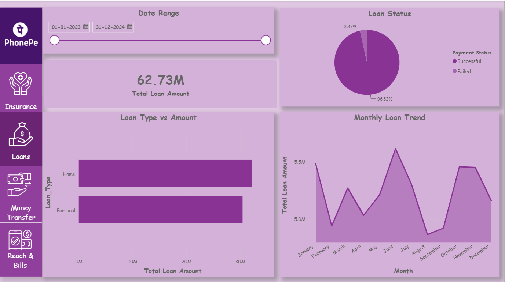
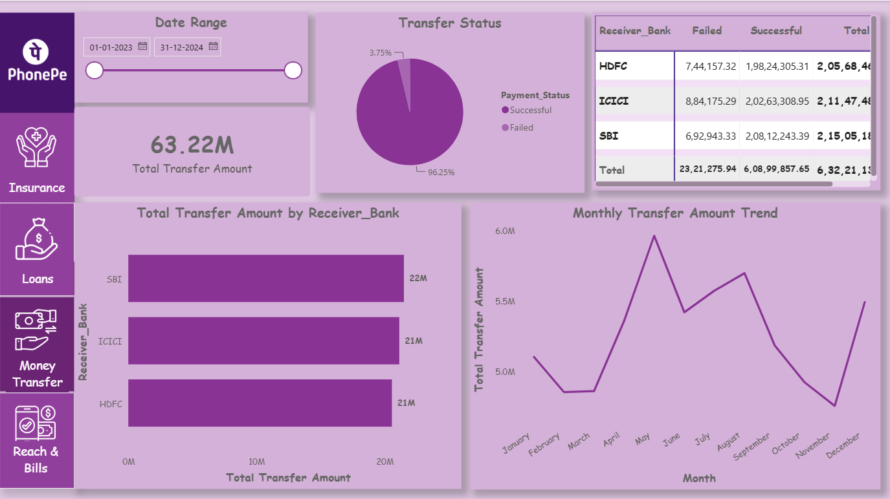
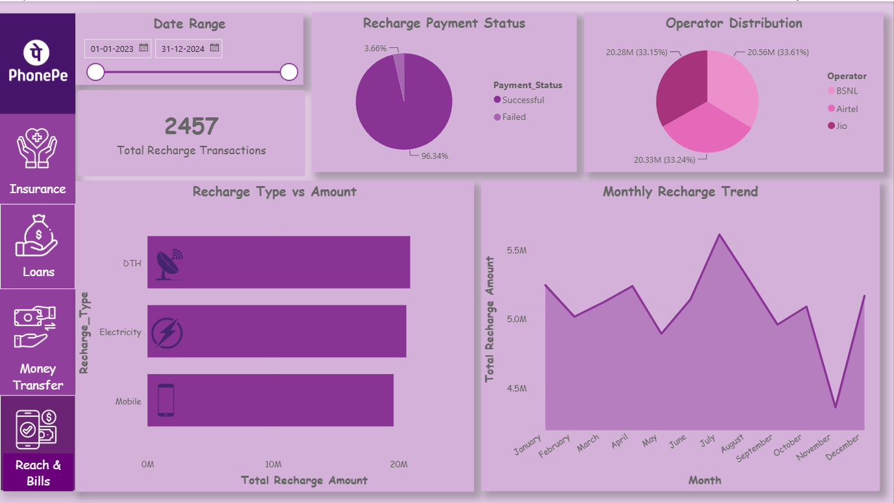

# 📊 PhonePe Business Intelligence Dashboard

A multi-page interactive **Business Intelligence Dashboard** built using **Power BI, DAX, Power Query, SQL, and Excel** to analyze PhonePe business transactions across multiple services.

---

## 🚀 Project Overview

This dashboard provides a complete analysis of PhonePe's business operations by monitoring:

- 💰 Total Transaction Amount
- 📈 Total Transactions
- ✅ Successful Payments
- ❌ Failed Payments
- 📊 Success Rate
- 📅 Monthly Performance Trends
- 🔍 Interactive Filtering & Navigation

The dashboard is divided into five business modules for better decision-making.

---

# 🛠️ Tools & Technologies

- Microsoft Power BI
- DAX
- Power Query
- SQL
- Microsoft Excel
- Data Modeling
- Git & GitHub

---

# 📂 Dashboard Pages

## 🏠 1. Home Dashboard

### Features
- Overall Business KPIs
- Total Amount
- Total Transactions
- Successful Payments
- Failed Payments
- Services Comparison
- Monthly Transaction Trend
- Failed Payment Analysis
- Date Slicer

### Preview



---

## 🛡️ 2. Insurance Dashboard

### Features

- Total Insurance Premium
- Insurance Payment Status
- Failed Payment Reasons
- Insurance Type vs Premium
- Monthly Premium Trend
- Interactive Date Filter

### Preview



---

## 💰 3. Loans Dashboard

### Features

- Total Loan Amount
- Loan Status Analysis
- Loan Type vs Amount
- Monthly Loan Trend
- Date Filter

### Preview



---

## 💸 4. Money Transfer Dashboard

### Features

- Total Transfer Amount
- Transfer Success Rate
- Receiver Bank Distribution
- Transfer Amount by Bank
- Monthly Transfer Trend
- Interactive Matrix
- Date Filter

### Preview



---

## 📱 5. Recharge & Bills Dashboard

### Features

- Total Recharge Amount
- Recharge Success Rate
- Operator Distribution
- Recharge Type Analysis
- Monthly Recharge Trend
- Interactive Date Filter

### Preview



---

# 📊 Key KPIs

- Total Amount
- Total Transactions
- Successful Transactions
- Failed Transactions
- Success Rate
- Monthly Trends
- Service-wise Analysis
- Category-wise Analysis

---

# 📁 Repository Structure

```
PhonePe-PowerBI-Dashboard
│
├── PhonePay.pbix
├── PhonePe_Clean_Dataset.xlsx
├── README.md
└── images
    ├── Home.png
    ├── Insurance.png
    ├── Loans.png
    ├── MoneyTransfer.png
    └── RechargeBills.png
```

---

# 📈 Business Insights

- More than **96%** of transactions are completed successfully.
- Insurance and Loan modules contribute significantly to business revenue.
- Monthly transaction trends help identify seasonal performance.
- Receiver bank analysis highlights transaction distribution across banks.
- Failed payment reasons help identify operational bottlenecks.

---

# 🎯 Skills Demonstrated

✔ Power BI Dashboard Development

✔ Data Cleaning with Power Query

✔ Data Modeling

✔ DAX Measures

✔ KPI Design

✔ Interactive Report Design

✔ Data Visualization

✔ Business Analysis

✔ SQL Data Handling

✔ GitHub Project Documentation

---

# 📥 Dataset

The dataset used in this project is included in this repository for learning and portfolio purposes.

---

# 👨‍💻 Author

**Arya Mane**

📧 Email: *(aaryamane2929@gmail.com)*

🔗 LinkedIn: *(linkedin.com/in/aryamane2929)*

🐙 GitHub: https://github.com/AryaMane29

---


